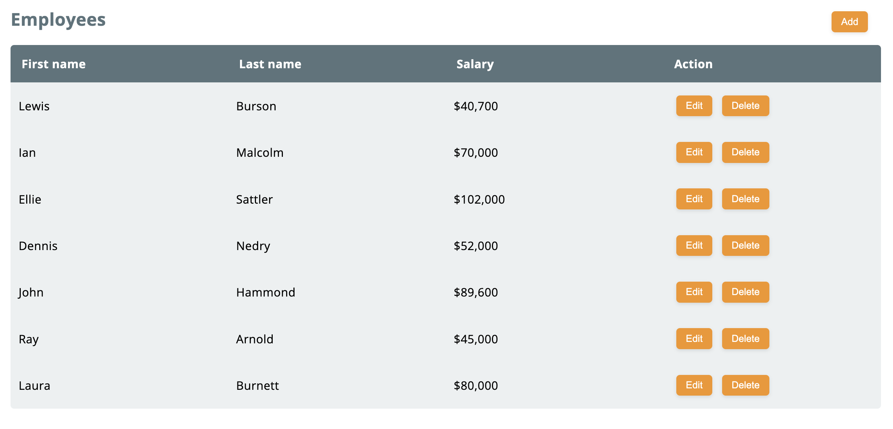

[](https://github.com/psf/black)

# Employees Management App



### Functional Requirements:

- Initially, list all employees that are in data.json
  - First name, last name, and salary in currency format (ie. $42,000)
- The ability to edit an employee
- The ability to delete an employee
- The ability to create a new employee

# prerequisite

- Docker
- docker-compose

```
$ docker-compose version
Docker Compose version v2.15.1
```

# Run with docker-compose

```Shell
# You can run whole app with just one command
$ docker-compose build --no-cache && docker-compose up
# You can run commands one by one.
$ docker-compose build --no-cache
$ docker-compose up
$ docker-compose down
```

# Sample Data insert Manually (In case it is not registered automatically)

```Shell
$ docker-compose exec employees-app poetry run python -m api.migrate_db
```

# Go to mysql CLI

```Shell
$ docker-compose exec db mysql employees
# to set encoding utf8
mysql> CHARSET utf8;
mysql> desc employees;
+------------+---------------+------+-----+---------+----------------+
| Field      | Type          | Null | Key | Default | Extra          |
+------------+---------------+------+-----+---------+----------------+
| id         | int           | NO   | PRI | NULL    | auto_increment |
| first_name | varchar(1024) | YES  |     | NULL    |                |
| last_name  | varchar(1024) | YES  |     | NULL    |                |
| salary     | int           | YES  |     | NULL    |                |
+------------+---------------+------+-----+---------+----------------+
4 rows in set (0.02 sec)
```

# Run Unit Test (FastAPI)

```Shell
$ docker-compose run --entrypoint "poetry run pytest --asyncio-mode=auto" employees-app
```

# Swagger UI (You can check API Specification here)

```Shell
http://localhost:8000/docs
```

# Run Frontend(Vue.js) mannually

```
$ yarn install
$ yarn serve
```
